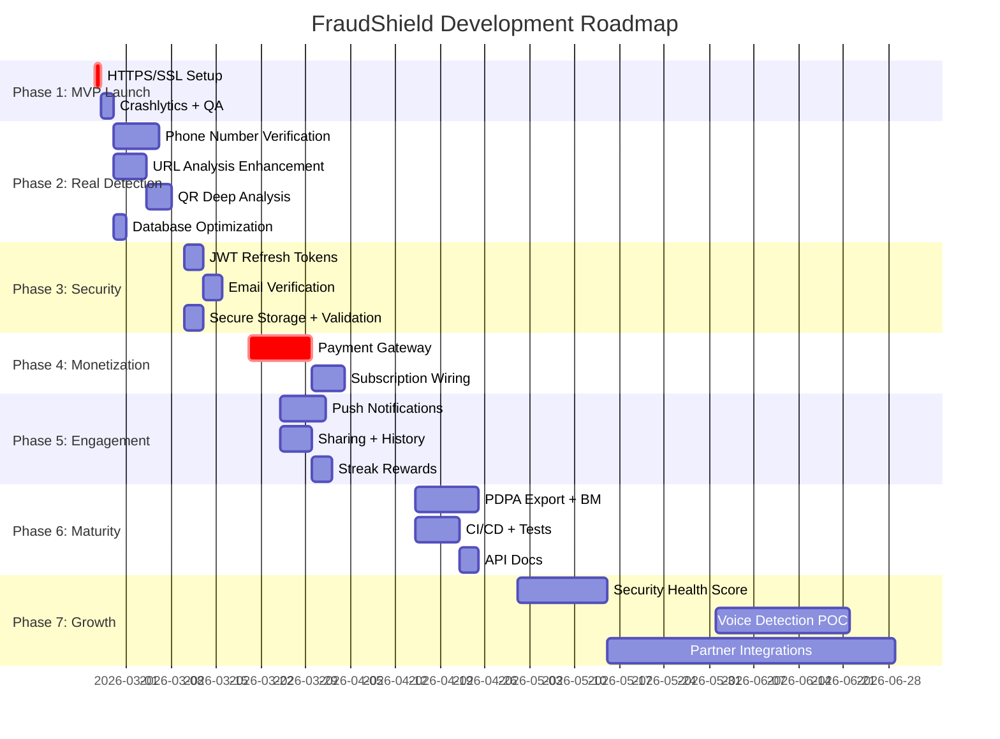

# FraudShield — Core Features Development Roadmap

> **Last updated:** 22 Feb 2026
> **Status:** MVP ~78% ready · 1 critical blocker remaining (HTTPS/SSL)

---

## Current State: What's Built vs What's Real

| Feature | Frontend | Backend | Real or Mock? |
|---------|:--------:|:-------:|:-------------:|
| **Fraud Check** (Phone/URL/Bank/Doc) | ✅ | ✅ | ⚠️ URL is real (Google Safe Browsing), rest is heuristic |
| **QR Scanner** | ✅ | ✅ | ⚠️ Basic keyword matching on decoded URLs |
| **Scam Reporting** | ✅ | ✅ | ✅ Real — submits to PostgreSQL with evidence |
| **Community Feed + Verification** | ✅ | ✅ | ✅ Real — with gamification, badges, points |
| **Voice Scam Detection** | ✅ | ❌ | 🚫 Mock → now hidden behind "Coming Soon" |
| **Transaction Risk Alerts** | ✅ | ❌ | 🚫 Mock — no real transaction monitoring |
| **Subscription System** | ✅ | ✅ | ⚠️ DB & plans exist, no payment gateway |
| **Rewards / Points Store** | ✅ | ✅ | ✅ Real — points, redemptions, badges |
| **Scam Map** | ✅ | ✅ | ✅ Real — geo-tagged reports on map |
| **Badge System** | ✅ | ✅ | ✅ Real — evaluation engine, definitions, awards |
| **User Auth** | ✅ | ✅ | ✅ Real — signup, login, password change, forgot password |
| **PDPA Compliance** | ✅ | ✅ | ✅ Privacy Policy, ToS, consent, account deletion |
| **Security Health Score** | ❌ | ❌ | ❌ Not started |
| **Push Notifications** | ❌ | ❌ | ❌ Not started |

### Infrastructure Summary

| Component | Status |
|-----------|--------|
| **Backend** | Node.js + Express + Prisma + PostgreSQL + Redis on DigitalOcean |
| **Frontend** | Flutter (37 screens, 24 widgets, 6 services) |
| **Database** | 14 Prisma models (User, Profile, ScamReport, Verification, etc.) |
| **Deployment** | Docker Compose on DigitalOcean droplet |
| **HTTPS** | ❌ Not configured — **last MVP blocker** |
| **CI/CD** | ❌ No automated pipeline |
| **Testing** | Auth controller only (Jest) |

---

## Phase 1: MVP Launch (Week 1)
*Goal: Ship to App Store & Play Store*

| # | Task | Est. | Status | Priority |
|---|------|------|--------|----------|
| 1.1 | Set up HTTPS/SSL with nginx + Let's Encrypt | 1-2 hrs | ❌ | 🔴 BLOCKER |
| 1.2 | Integrate Firebase Crashlytics | 1 hr | ❌ | 🟠 Recommended |
| 1.3 | Remove debug logging from production builds | 30 min | ❌ | 🟡 Polish |
| 1.4 | Final QA pass on all screens | 2 hrs | ❌ | 🟠 Recommended |
| 1.5 | Submit to Google Play Store (internal testing) | 1 hr | ✅ Done | ✅ |
| 1.6 | Prepare App Store listing (screenshots, description) | 2 hrs | ⚠️ Partial | 🟠 |

**Exit criteria:** App is live on at least Google Play internal track with HTTPS enabled.

---

## Phase 2: Make Core Features Real (Weeks 2–4)
*Goal: Transform heuristic checks into genuinely useful detection*

### 2A. Phone Number Verification

| # | Task | Est. | Priority |
|---|------|------|----------|
| 2A.1 | Research CCID Semak Mule API (scraping/API access) | 2 hrs | 🔴 |
| 2A.2 | Build backend proxy endpoint `/api/fraud/phone-lookup` | 3 hrs | 🔴 |
| 2A.3 | Crowdsource from community reports — query internal `ScamReport` DB for phone numbers | 2 hrs | 🟠 |
| 2A.4 | Update Flutter `fraud_check_screen.dart` to show source of check (CCID, community, etc.) | 2 hrs | 🟠 |

### 2B. Enhanced URL Analysis

| # | Task | Est. | Priority |
|---|------|------|----------|
| 2B.1 | ✅ Google Safe Browsing API integration | Done | ✅ |
| 2B.2 | Add VirusTotal API as secondary source (free tier: 4 req/min) | 2 hrs | 🟠 |
| 2B.3 | Build URL redirect-following for shortened links (bit.ly, tinyurl) | 3 hrs | 🟠 |
| 2B.4 | Display check source in results ("Verified against Google Safe Browsing") | 1 hr | 🟡 |

### 2C. QR Code Deep Analysis

| # | Task | Est. | Priority |
|---|------|------|----------|
| 2C.1 | Follow redirects on decoded QR URLs before analysis | 2 hrs | 🟠 |
| 2C.2 | Cross-reference decoded URLs against Google Safe Browsing | 1 hr | 🟠 |
| 2C.3 | Detect and warn about unusual QR data (non-URL content, large payloads) | 2 hrs | 🟡 |

### 2D. Database & Performance

| # | Task | Est. | Priority |
|---|------|------|----------|
| 2D.1 | Add database indexes (ScamReport fields) | 15 min | 🔴 |
| 2D.2 | Add unique constraint on Verification `[reportId, userId]` | 10 min | 🔴 |
| 2D.3 | Add API pagination to `getPublicFeed`, `getMyReports`, `searchReports` | 1 hr | 🟠 |
| 2D.4 | Configure DB connection pooling | 10 min | 🟡 |

**Exit criteria:** At least 2 fraud check types use real external data sources. Database is indexed.

---

## Phase 3: Security Hardening (Weeks 3–5)
*Goal: Raise security posture appropriate for an anti-fraud app*

| # | Task | Est. | Priority |
|---|------|------|----------|
| 3.1 | JWT refresh token flow (15-min access + 30-day refresh) | 3 hrs | 🟠 |
| 3.2 | Email verification on signup | 3 hrs | 🟠 |
| 3.3 | Input validation on report submission (express-validator) | 1 hr | 🟠 |
| 3.4 | Secure token storage (flutter_secure_storage) | 1 hr | 🟠 |
| 3.5 | Certificate pinning | 1 hr | 🟡 |
| 3.6 | App versioning check (force update mechanism) | 1 hr | 🟡 |
| 3.7 | Soft delete for ScamReport | 30 min | 🟡 |
| 3.8 | Docker health checks, pinned image versions, log rotation | 30 min | 🟡 |

**Exit criteria:** Refresh tokens implemented, signup requires email verification, tokens stored securely.

---

## Phase 4: Monetization & Payment (Weeks 5–8)
*Goal: Enable real revenue collection*

| # | Task | Est. | Priority |
|---|------|------|----------|
| 4.1 | Integrate payment gateway (Billplz / Stripe MY / Revenue Monster) | 8 hrs | 🔴 |
| 4.2 | Wire subscription creation to payment flow | 3 hrs | 🔴 |
| 4.3 | Add payment receipt / invoice generation | 2 hrs | 🟠 |
| 4.4 | Implement subscription expiry and renewal logic | 3 hrs | 🟠 |
| 4.5 | Re-enable and complete rewards routes | 1 hr | 🟡 |
| 4.6 | Implement free trial (14-day) flow | 2 hrs | 🟡 |

### Recommended Pricing

| Tier | Price | Target Audience |
|------|-------|-----------------|
| Free Shield | RM 0 | Everyone — must be genuinely useful |
| Shield Basic | RM 2.99/mo (RM 29.90/yr) | Gen Z, gig workers |
| Shield Family | RM 5.99/mo (RM 59.90/yr) | Heads of household |

**Exit criteria:** At least one working payment flow; users can pay and receive premium features.

---

## Phase 5: Engagement & Retention (Weeks 6–10)
*Goal: Prevent "one-time use" app syndrome*

| # | Task | Est. | Priority |
|---|------|------|----------|
| 5.1 | Push notification scam alerts (Firebase Cloud Messaging) | 6 hrs | 🔴 |
| 5.2 | "Daily scam digest" notification system | 4 hrs | 🟠 |
| 5.3 | Recent checks history (local storage) | 2 hrs | 🟠 |
| 5.4 | Share scam warnings to WhatsApp | 2 hrs | 🟠 |
| 5.5 | Streak rewards ("check in daily to level up") | 3 hrs | 🟡 |
| 5.6 | Community scam heat map (enhanced `scam_map_screen.dart`) | 4 hrs | 🟡 |
| 5.7 | Emergency CTA ("Call Police" / "Call Bank") on high-risk results | 1 hr | 🟡 |

**Exit criteria:** Push notifications working, daily digest configured, WhatsApp sharing enabled.

---

## Phase 6: Compliance, Testing & Platform Maturity (Weeks 8–12)
*Goal: Production-grade reliability and legal compliance*

| # | Task | Est. | Priority |
|---|------|------|----------|
| 6.1 | PDPA data export ("Download My Data") | 2 hrs | 🟠 |
| 6.2 | Terms of Service update consent tracking | 1 hr | 🟡 |
| 6.3 | Structured logging with Winston | 1 hr | 🟡 |
| 6.4 | Unit tests for report, rewards, feature controllers | 4 hrs | 🟠 |
| 6.5 | API documentation (Swagger/OpenAPI) | 2 hrs | 🟡 |
| 6.6 | CI/CD pipeline (GitHub Actions) | 3 hrs | 🟠 |
| 6.7 | Proper loading/error states across all screens | 2 hrs | 🟡 |
| 6.8 | Bahasa Malaysia (BM) localization | 6 hrs | 🟠 |

**Exit criteria:** Data export functional, CI/CD running, BM support shipped.

---

## Phase 7: Differentiation & Growth (Months 4–6)
*Goal: Build defensible competitive moats*

| # | Task | Est. | Priority |
|---|------|------|----------|
| 7.1 | Security Health Score (computed from user behavior + checks) | 2 wks | 🟡 |
| 7.2 | Family protection (share shield with family members) | 2 wks | 🟡 |
| 7.3 | Android home screen widget (latest scam alerts) | 1 wk | 🟡 |
| 7.4 | Voice detection research/POC (Whisper API on transcripts) | 3 wks | 🟡 |
| 7.5 | Telco API partnerships (Maxis/Celcom/Digi) | Ongoing | 🟡 |
| 7.6 | Bank API partnerships for transaction monitoring | Ongoing | 🟡 |
| 7.7 | B2B data licensing (sell scam intelligence to banks) | Ongoing | 🟡 |

---

## Timeline Overview

---

## Effort Summary

| Phase | Items | Est. Hours | Timeline |
|-------|:-----:|:----------:|----------|
| **1. MVP Launch** | 4 remaining | ~6 hrs | Week 1 |
| **2. Real Detection** | 12 items | ~20 hrs | Weeks 2–4 |
| **3. Security Hardening** | 8 items | ~12 hrs | Weeks 3–5 |
| **4. Monetization** | 6 items | ~19 hrs | Weeks 5–8 |
| **5. Engagement & Retention** | 7 items | ~22 hrs | Weeks 6–10 |
| **6. Compliance & Testing** | 8 items | ~21 hrs | Weeks 8–12 |
| **7. Differentiation** | 7 items | 6+ weeks | Months 4–6 |
| **Grand Total** | **52 items** | **~100 hrs** (Phases 1–6) | **~3 months** |

---

## Key Decision Points

> [!IMPORTANT]
> ### Decisions to Make Before Phase 4
> 1. **Payment gateway choice:** Billplz (MY-focused, simple) vs Stripe (global, more features) vs Revenue Monster (MY, multiple methods)
> 2. **Push notification service:** Firebase Cloud Messaging (free, Google) vs OneSignal (free tier, more control)
> 3. **Phone number data source:** CCID Semak Mule (official, may require partnership) vs community crowdsource only
> 4. **Pricing strategy:** Confirm RM 2.99/5.99 tiers or adjust based on early user feedback

> [!WARNING]
> ### Risks to Monitor
> - **Solo developer velocity** — 100 hrs = ~3 months at part-time. Consider hiring Phase 4+.
> - **Scam data quality** — Crowdsourced reports need verification to avoid defamation risk.
> - **Voice detection** — Still 6+ months away. Keep it hidden until real POC works.
> - **App Store rejection** — iOS may flag security/fraud apps for additional review.
