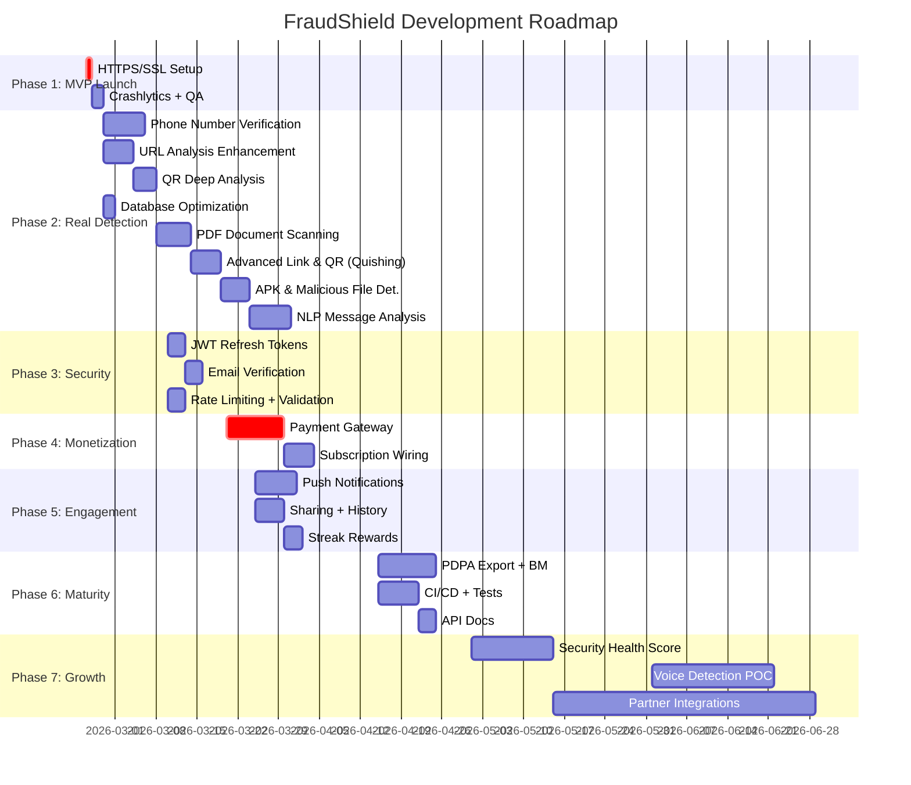

# FraudShield — Core Features Development Roadmap

> **Last updated:** 28 Feb 2026
> **Status:** MVP 🚀 Live · NLP / Voice (Phase B) / APK / PDF / QR Scanning Backend ✅ · Community Feed Polished

---

## Current State: What's Built vs What's Real

| Feature | Frontend | Backend | Status |
|---------|:--------:|:-------:|:------:|
| **Fraud Check** (Phone/URL/Bank/Doc) | ✅ | ✅ | ✅ Real — CCID Semak Mule, Safe Browsing, PDF/APK/NLP all wired |
| **QR Scanner** | ✅ | ✅ | ✅ Real — Redirect chain + Safe Browsing + VirusTotal (QuishingService) |
| **Scam Reporting** | ✅ | ✅ | ✅ Real — PostgreSQL with evidence |
| **Community Feed + Verification** | ✅ | ✅ | ✅ Real — gamification, badges, points |
| **Voice Scam Detection** | ✅ | ✅ | ✅ Real — Whisper AI + Behavioral Heuristics |
| **Transaction Journal** | ✅ | ✅ | ✅ Real — manual logging with categories (PHONE/BANK/DOC) |
| **Subscription System** | ✅ | ✅ | ⚠️ DB & plans exist, no payment gateway |
| **Rewards / Points Store** | ✅ | ✅ | ✅ Real — catalog, redemptions, points history |
| **Scam Map** | ✅ | ✅ | ✅ Real — geo-tagged reports on map |
| **Badge System** | ✅ | ✅ | ✅ Real — evaluation engine, definitions, awards |
| **User Auth** | ✅ | ✅ | ✅ Real — full flow incl. forgot password |
| **User Profile** | ✅ | ✅ | ✅ Real — view, edit, statistics |
| **PDPA Compliance** | ✅ | ✅ | ✅ Privacy Policy, ToS, consent, deletion |
| **Transaction Risk Alerts** | ✅ | 🟠 | In Progress — UI built, basic rules engine pending |
| **Security Health Score** | ✅ | 🟠 | 🟠 In Progress — UI built, logic integration started |
| **Push Notifications** | ✅ | ✅ | ✅ Real — FCM integrated via AlertEngine |
| **NLP Message Analysis** | ✅ | ✅ | ✅ Real — multi-language (EN/BM/ZH) regex + urgency scoring |
| **PDF Document Scanning** | ✅ | ✅ | ✅ Real — pdf-parse + keyword engine + VirusTotal hash check |
| **APK/Malicious File Detection** | ✅ | ✅ | ✅ Real — permissions, entropy, package name, VirusTotal |
| **WhatsApp Alert Sharing** | ✅ | — | ⚠️ Partial — share_plus integrated in several screens, no deep-link |

### Infrastructure Summary

| Component | Status |
|-----------|--------|
| **Backend** | Node.js + Express + Prisma + PostgreSQL + Redis on DigitalOcean |
| **Frontend** | Flutter (42 screens, 24 widgets, 6 services) |
| **Database** | 16 Prisma models (incl. TransactionJournal, BadgeDefinition, AlertSubscription) |
| **Deployment** | Docker Compose on DigitalOcean droplet |
| **HTTPS** | ✅ Live on `api.fraudshieldprotect.com` (Feb 24) |
| **CI/CD** | ❌ No automated pipeline |
| **Testing** | Auth controller only (Jest) |

---

## Phase 1: MVP Launch (Week 1)
*Goal: Ship to App Store & Play Store*

| # | Task | Est. | Status |
|---|------|------|--------|
| 1.1 | Set up HTTPS/SSL with nginx + Let's Encrypt | 1-2 hrs | ✅ Done |
| 1.2 | Integrate Firebase Crashlytics | 1 hr | ✅ Done |
| 1.3 | Remove debug logging from production builds | 30 min | ⚠️ Polish |
| 1.4 | Final QA pass on all 42 screens | 2 hrs | ⚠️ Recommended |
| 1.5 | Submit to Google Play Store (internal testing) | — | ✅ Done |
| 1.6 | Prepare App Store listing | 2 hrs | ⚠️ Partial |

**Exit criteria:** ✅ Met — App live with HTTPS on `api.fraudshieldprotect.com`.

---

## Phase 2: Make Core Features Real (Weeks 2–4)
*Goal: Transform heuristic checks into genuinely useful detection*

### 2A. Phone Number Verification

| # | Task | Est. | Priority |
|---|------|------|----------|
| 2A.1 | Research CCID Semak Mule API | 2 hrs | ✅ Done |
| 2A.2 | Build backend proxy `/api/fraud/phone-lookup` | 3 hrs | ✅ Done |
| 2A.3 | Crowdsource from community ScamReport DB | 2 hrs | ✅ Done |
| 2A.4 | Show source of check in Flutter UI | 2 hrs | ✅ Done |

### 2B. Enhanced URL Analysis

| # | Task | Est. | Priority |
|---|------|------|----------|
| 2B.1 | Google Safe Browsing API | — | ✅ Done |
| 2B.2 | VirusTotal API secondary source | 2 hrs | ✅ Done — wired in APK, PDF & QR services |
| 2B.3 | URL redirect-following for shortened links | 3 hrs | ✅ Done — QuishingService._followRedirects |
| 2B.4 | Display check source in results | 1 hr | ✅ Done — detectedBy[] field in response |

### 2C. QR Code Deep Analysis

| # | Task | Est. | Priority |
|---|------|------|----------|
| 2C.1 | Follow redirects on decoded QR URLs | 2 hrs | ✅ Done — QuishingService._followRedirects (up to 10 hops) |
| 2C.2 | Cross-reference against Google Safe Browsing | 1 hr | ✅ Done — QuishingService._checkSafeBrowsing |
| 2C.3 | Detect unusual QR data | 2 hrs | ✅ Done — QuishingService._heuristicCheck (typosquat, homograph, etc.) |

### 2D. Database & Performance

| # | Task | Est. | Priority |
|---|------|------|----------|
| 2D.1 | Add ScamReport indexes | 15 min | ✅ Done |
| 2D.2 | Unique constraint on Verification | 10 min | ✅ Done |
| 2D.3 | API pagination | 1 hr | ✅ Done |
| 2D.4 | DB connection pooling | 10 min | ✅ Done |

### 2E. PDF Document Scanning

| # | Task | Est. | Priority |
|---|------|------|----------|
| 2E.1 | Backend: PDF text/metadata extraction (pdf-parse) | 3 hrs | ✅ Done — PdfScanService.analyze |
| 2E.2 | Backend: Keyword-based risk engine integration | 2 hrs | ✅ Done — SCAM_PHRASE_PATTERNS with EN/BM |
| 2E.3 | Backend: SHA-256 document fingerprinting | 1 hr | ✅ Done — crypto.createHash + Redis cache |
| 2E.4 | Frontend: PDF picker and upload flow | 3 hrs | ✅ Done |
| 2E.5 | Frontend: OCR detection (future enhancement) | 6 hrs | 🟡 |

### 2F. Advanced Link & QR Analysis (Quishing)

| # | Task | Est. | Priority |
|---|------|------|----------|
| 2F.1 | QR Deep Scan: Extract & analyze redirect chains | 4 hrs | ✅ Done — QuishingService |
| 2F.2 | QR Logo/Overlay detection (basic visual check) | 6 hrs | 🟡 |
| 2F.3 | Integrated URL/QR risk score in Fraud Check UI | 2 hrs | ✅ Done |

### 2G. APK & Malicious File detection

| # | Task | Est. | Priority |
|---|------|------|----------|
| 2G.1 | APK Signature & Package Name verification | 4 hrs |  Frontend UI Done |
| 2G.2 | Manifest permission analysis (High-risk patterns) | 5 hrs | 🟠 |
| 2G.3 | File entropy & obfuscation check | 3 hrs | 🟡 |

### 2H. NLP-based Message Analysis

| # | Task | Est. | Priority |
|---|------|------|----------|
| 2H.1 | Content-based scam likelihood (NLP/Regex) | 6 hrs | ✅ Done — NlpMessageService: 50+ regex patterns |
| 2H.2 | Multi-language support (BM/English/Chinese) | 8 hrs | ✅ Done — NlpMessageService: EN/BM patterns + detectLanguage |
| 2H.3 | Paste-to-check interface (Smart Omnibar) | 2 hrs | ✅ Done |

**Exit criteria:** ≥5 fraud check types use real data (Phone, URL, PDF, QR, APK). NLP scoring integrated.

---

## Phase 3: Security Hardening (Weeks 3–5)

| # | Task | Est. | Priority |
|---|------|------|----------|
| 3.1 | JWT refresh token flow | 3 hrs | ✅ Done |
| 3.2 | Email verification on signup | 3 hrs | ✅ Done |
| 3.3 | Input validation (express-validator) | 1 hr | ✅ Done |
| 3.4 | Rate limiting on auth endpoints | 30 min | ✅ Done |
| 3.5 | Secure token storage (flutter_secure_storage) | 1 hr | ✅ Done |
| 3.6 | Certificate pinning | 1 hr | ✅ Done |
| 3.7 | App versioning / force update | 1 hr | ✅ Done |
| 3.8 | Soft delete for ScamReport | 30 min | ✅ Done |
| 3.9 | Docker healthcheck, pin versions, log rotation | 30 min | ✅ Done |
| 3.10 | Google Sign-In integration | 4 hrs | ✅ Done |

---

## Phase 4: Monetization & Payment (Weeks 5–8)

| # | Task | Est. | Priority |
|---|------|------|----------|
| 4.1 | Payment gateway (Billplz / Stripe / Revenue Monster) | 8 hrs | 🔴 |
| 4.2 | Wire subscription to payment flow | 3 hrs | 🔴 |
| 4.3 | Payment receipt / invoice | 2 hrs | 🟠 |
| 4.4 | Subscription expiry & renewal | 3 hrs | 🟠 |
| 4.5 | Wire rewards to payment | 1 hr | 🟡 |
| 4.6 | Free trial (14-day) | 2 hrs | 🟡 |

### Pricing

| Tier | Price | Target |
|------|-------|--------|
| Free Shield | RM 0 | Everyone |
| Shield Basic | RM 2.99/mo | Gen Z, gig workers |
| Shield Family | RM 5.99/mo | Heads of household |

---

## Phase 5: Engagement & Retention (Weeks 6–10)

| # | Task | Est. | Status |
|---|------|------|--------|
| 5.1 | Push notifications (FCM) | 6 hrs | ✅ Done |
| 5.2 | Daily scam digest | 4 hrs | ✅ Done |
| 5.3 | Recent checks history | 2 hrs | ✅ Done |
| 5.4 | WhatsApp sharing | 2 hrs | ⚠️ Partial — share_plus wired in scam_card, report_details, transaction_detail |
| 5.5 | Streak rewards | 3 hrs | 🟡 |
| 5.6 | Enhanced scam heat map | 4 hrs | 🟡 |
| 5.7 | Emergency CTA on high-risk results | 1 hr | 🟡 |

---

## Phase 6: Compliance, Testing & Maturity (Weeks 8–12)

| # | Task | Est. | Priority |
|---|------|------|----------|
| 6.1 | PDPA data export | 2 hrs | ✅ Done |
| 6.2 | Terms update consent tracking | 1 hr | ✅ Done |
| 6.3 | Structured logging (Winston) | 1 hr | ✅ Done |
| 6.4 | Unit tests for all controllers | 4 hrs | 🟠 |
| 6.5 | API docs (Swagger/OpenAPI) | 2 hrs | ✅ Done |
| 6.6 | CI/CD pipeline (GitHub Actions) | 3 hrs | 🔴 Not started — no .yml files in repo |
| 6.7 | Loading/error states across 42 screens | 2 hrs | ✅ Done |
| 6.8 | Bahasa Malaysia localization | 6 hrs | 🔴 Not started — no intl/AppLocalizations in codebase |

---

## Phase 7: Differentiation & Growth (Months 4–6)

| # | Task | Est. |
|---|------|------|
| 7.1 | Security Health Score (Refined UI) | 2 wks | ✅ UI Done |
| 7.2 | Family protection | 2 wks |
| 7.3 | Android home screen widget | 1 wk |
| 7.4 | Voice detection POC (Whisper API) | 3 wks | ✅ Done |
| 7.5 | Telco API partnerships | Ongoing |
| 7.6 | Bank API partnerships | Ongoing |
| 7.7 | B2B data licensing | Ongoing |

---

## Timeline Overview

```mermaid
gantt
    title FraudShield Development Roadmap
    dateFormat YYYY-MM-DD
    
    section Phase 1: MVP Launch
    HTTPS/SSL Setup              :crit, p1a, 2026-02-24, 1d
    Crashlytics + QA             :p1b, after p1a, 2d
    
    section Phase 2: Real Detection
    Phone Number Verification    :p2a, 2026-02-27, 7d
    URL Analysis Enhancement     :p2b, 2026-02-27, 5d
    QR Deep Analysis             :p2c, 2026-03-04, 4d
    Database Optimization        :p2d, 2026-02-27, 2d
    PDF Document Scanning        :p2e, 2026-03-08, 6d
    Advanced Link & QR (Quishing):p2f, 2026-03-14, 5d
    APK & Malicious File Det.    :p2g, 2026-03-19, 5d
    NLP Message Analysis         :p2h, 2026-03-24, 7d
    
    section Phase 3: Security
    JWT Refresh Tokens           :p3a, 2026-03-10, 3d
    Email Verification           :p3b, after p3a, 3d
    Rate Limiting + Validation   :p3c, 2026-03-10, 3d
    
    section Phase 4: Monetization
    Payment Gateway              :crit, p4a, 2026-03-20, 10d
    Subscription Wiring          :p4b, after p4a, 5d
    
    section Phase 5: Engagement
    Push Notifications           :p5a, 2026-03-25, 7d
    Sharing + History            :p5b, 2026-03-25, 5d
    Streak Rewards               :p5c, after p5b, 3d
    
    section Phase 6: Maturity
    PDPA Export + BM             :p6a, 2026-04-15, 10d
    CI/CD + Tests                :p6b, 2026-04-15, 7d
    API Docs                     :p6c, after p6b, 3d
    
    section Phase 7: Growth
    Security Health Score        :p7a, 2026-05-01, 14d
    Voice Detection POC          :p7b, 2026-06-01, 21d
    Partner Integrations         :p7c, 2026-05-15, 45d
```

---

## Effort Summary

| Phase | Items | Est. Hours | Timeline |
|-------|:-----:|:----------:|----------|
| **1. MVP Launch** | 3 remaining | ~5 hrs | Week 1 |
| **2. Real Detection** | 26 items | ~80 hrs | Weeks 2–6 |
| **3. Security Hardening** | 9 items | ~13 hrs | Weeks 4–7 |
| **4. Monetization** | 6 items | ~19 hrs | Weeks 7–10 |
| **5. Engagement** | 6 remaining | ~20 hrs | Weeks 8–12 |
| **6. Compliance & Testing** | 8 items | ~21 hrs | Weeks {10–14 |
| **7. Differentiation** | 7 items | 6+ weeks | Months 4–6 |
| **Grand Total** | **65 items** | **~158 hrs** (Ph 1–6) | **~4 months** |

---

## Key Decision Points

> [!IMPORTANT]
> ### Decisions Before Phase 4
> 1. **Payment gateway:** Billplz vs Stripe vs Revenue Monster
> 2. **Push notifications:** FCM vs OneSignal
> 3. **Phone data source:** CCID Semak Mule vs community crowdsource
> 4. **Pricing:** Confirm RM 2.99/5.99 tiers

> [!WARNING]
> ### Risks
> - **Solo dev velocity** — 98 hrs ≈ 3 months part-time
> - **Scam data quality** — crowdsourced reports need verification
> - **Voice detection** — 6+ months away, keep hidden
> - **Transaction Risk Alerts** — currently mock, do NOT market as real
