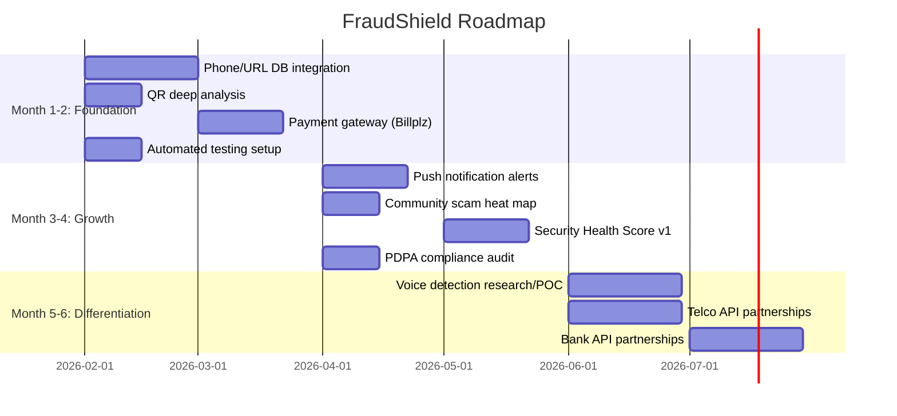

# FraudShield — Full Strategic Review
### Anti-Fraud Mobile App for Malaysia

**Review Date:** February 12, 2026  
**Perspectives:** Fintech Product Director · Cybersecurity Architect · Mobile UX Lead · VC Investor  
**Codebase Analyzed:** [fraudshield/](file:///c:/Fraudshield/fraudshield) (Flutter) + [fraudshield-backend/](file:///c:/Fraudshield/fraudshield-backend) (Node.js)

---

## Executive Summary

FraudShield is an early-stage anti-fraud mobile app targeting Malaysian consumers (Gen Z, B40, gig workers). The codebase has **a functional UI shell with community features and gamification**, but the **core fraud detection engine is entirely heuristic/mock** — there is no real AI/ML, no external scam database, no payment integration, and no automated testing. The product concept has strong PMF potential in Malaysia, but the current implementation is 6–9 months away from a credible production launch at 50K users.

> [!CAUTION]
> **The single biggest risk**: the "Voice Scam Detection" feature — your highest-value paid feature — is completely mocked. It uses `DateTime.now().second % 2 == 0` to randomly determine if a call is suspicious. If this ships, it will destroy user trust irreversibly.

---

## 1️⃣ Product Strategy & Roadmap

### What You Have Today (Honest Assessment)

| Feature | Status | Real or Mock? |
|---|---|---|
| Fraud Check (Phone/URL/Bank/Doc) | Built | **Mock** — hardcoded heuristic rules only |
| QR Scanner Detection | Built | **Partially real** — keyword matching on URLs |
| Scam Reporting | Built | **Real** — submits to PostgreSQL |
| Community Feed + Verification | Built | **Real** — with gamification/badges |
| Voice Scam Detection | Built | **Completely mock** — random result |
| Transaction Risk Alerts | Built | **Mock** — no real transaction monitoring |
| Subscription System | Built | **Partially real** — no payment gateway |
| Security Health Score | Not started | Planned |

### True MVP: What to Build First (Weeks 1–6)

> The question isn't "what features to build." The question is: **"What can I make genuinely useful before anyone pays?"**

**Priority 1 — Make the free features actually work:**

1. **Phone Number Database Integration** — Integrate with [CCID Semak Mule](https://semakmule.rmp.gov.my/) or crowdsource from your own community reports. Without a real database lookup, your fraud check is useless.
2. **URL Reputation API** — Integrate Google Safe Browsing API (free) or VirusTotal API (free tier). Your current keyword-matching catches `bank` in `bankofamerica.com`.
3. **QR Code Deep Analysis** — Your URL analysis post-QR-scan is decent, but add redirect-following to catch shortened URLs.

**Priority 2 — Kill or delay paid features until they work:**

4. **🔪 KILL Voice Scam Detection for now.** You have no audio processing pipeline, no ML model, no Whisper integration working. Ship this as "Coming Soon" or it will be your #1 source of 1-star reviews.
5. **⏸️ DELAY Transaction Risk Alerts.** This requires bank API integration (PSD2 equivalent doesn't exist in Malaysia yet). Park it.
6. **⏸️ DELAY Security Health Score.** You don't have enough data inputs to compute a meaningful score yet.

**Priority 3 — Enable monetization (Weeks 6–12):**

7. **Payment Gateway Integration** — Integrate [Stripe Malaysia](https://stripe.com/my), [Revenue Monster](https://revenuemonster.my/), or [Billplz](https://www.billplz.com/) for actual subscription payments.
8. **Real-time Scam Alerts via Push Notifications** — This is your paid value: "We'll warn you when new scams are reported in your area." Much more viable than voice detection.

### RICE Prioritization

| Feature | Reach | Impact | Confidence | Effort | RICE Score | Verdict |
|---|---|---|---|---|---|---|
| Phone/URL database integration | 10 | 10 | 9 | 3 | **300** | 🟢 Build immediately |
| QR redirect-following | 8 | 7 | 8 | 2 | **224** | 🟢 Build immediately |
| Push notification scam alerts | 9 | 8 | 7 | 4 | **126** | 🟢 Build in Month 2 |
| Payment gateway | 7 | 9 | 9 | 5 | **113** | 🟢 Build in Month 2 |
| Community scam map (heat map) | 6 | 6 | 7 | 3 | **84** | 🟡 Month 3 |
| Security Health Score | 5 | 5 | 4 | 6 | **17** | 🟡 Month 4+ |
| Voice detection (real ML) | 6 | 8 | 2 | 10 | **10** | 🔴 Month 5+ or kill |
| Transaction monitoring | 4 | 7 | 2 | 10 | **6** | 🔴 Needs bank partnerships |

### 6-Month Roadmap



### Competitive Benchmarking

| Competitor | Strengths | FraudShield Advantage |
|---|---|---|
| **Maybank MAE / CIMB Octo** | Built into banking, large user base | Cross-bank coverage, community reporting |
| **CCID Semak Mule** | Official police database | Better UX, proactive alerts, mobile-first |
| **Kaspersky / Norton** | Deep malware scanning | Malaysia-specific scam intelligence |
| **ScamAdviser.com** | Global URL/domain database | BM language support, QR scanning, offline |
| **Truecaller** | Phone number ID, huge database | Scam-focused vs. spam-focused |

**Winning Strategy:** Position as "Malaysia's Truecaller for scams" — community-powered, mobile-first, BM-first. Don't try to compete on deep cybersecurity. Compete on **accessibility and local relevance**.

---

## 2️⃣ Production-Ready Checklist (50K Users)

### What Will Break First

| Risk | Severity | Current Status | What Will Happen |
|---|---|---|---|
| **No real fraud detection** | 🔴 CRITICAL | Heuristic rules only | Users get useless results → instant uninstall |
| **No payment integration** | 🔴 CRITICAL | Subscriptions created without payment | Revenue = RM 0 |
| **No automated tests** | 🔴 CRITICAL | Zero tests in codebase | Every deploy is a prayer |
| **JWT with no refresh tokens** | 🟠 HIGH | Token never expires/refreshes | Users randomly get logged out |
| **No rate limiting on auth** | 🟠 HIGH | `express-rate-limit` imported but not applied to auth routes | Brute force attacks trivial |
| **Passwords logged to console** | 🔴 CRITICAL | [api_service.dart line 45](file:///c:/Fraudshield/fraudshield/lib/services/api_service.dart#L45) prints request bodies | PDPA violation, security disaster |
| **Docker credentials in source** | 🟠 HIGH | [docker-compose.yml](file:///c:/Fraudshield/fraudshield-backend/docker-compose.yml) has hardcoded passwords | Anyone with repo access has DB admin |
| **No input validation** | 🟠 HIGH | `express-validator` imported but not used in controllers | SQL injection, XSS possible |
| **Socket.io with no auth** | 🟠 HIGH | Any client can connect and listen to any user room | User data leakage |
| **File upload with no validation** | 🟠 HIGH | `multer` accepts any file type/size | Server disk exhaustion, malware hosting |

### What Will Cause Bad Reviews

1. **Voice Detection giving random results** — users will test this, realize it's fake, and leave 1-star reviews
2. **Fraud Check "Low Risk" on known scam numbers** — no real database = false negatives
3. **Being charged without real payment flow** — subscription activates immediately without billing
4. **App feels slow** — no skeleton loaders on most screens; API calls block UI
5. **No Bahasa Malaysia support** — your target B40 segment predominantly uses BM

### What Will Cause Legal Trouble

> [!WARNING]
> **PDPA Malaysia (Personal Data Protection Act 2010)**

1. **No privacy policy** — required before collecting any personal data
2. **No consent mechanism** — user data collected without explicit consent notice
3. **Password-adjacent data logged** — [api_service.dart](file:///c:/Fraudshield/fraudshield/lib/services/api_service.dart) logs request bodies to console
4. **No data retention policy** — ScamReports, BehavioralEvents stored indefinitely
5. **No data export/deletion** — PDPA grants data subjects right to access and delete
6. **QR Scanner + Voice Recording = surveillance** — needs explicit permission rationale and disclosure
7. **Scam database with user reports** — publishing "scam" labels on phone numbers/accounts is potential **defamation** risk without verification

### Encryption & Security Audit

| Requirement | Status | Action Needed |
|---|---|---|
| HTTPS/TLS in transit | ❌ Not enforced | Backend runs on HTTP; no SSL config |
| Encryption at rest | ⚠️ Depends on hosting | PostgreSQL not configured with TDE |
| Password hashing | ✅ bcrypt | Good — using bcrypt with auto-salt |
| JWT secret management | ⚠️ In `.env` file | Move to cloud secrets manager |
| API key rotation | ❌ Not implemented | No mechanism to rotate JWT secret |
| CORS configuration | ⚠️ `*` fallback | Default allows any origin |

### Cloud Cost Projection (50K Users)

| Service | Estimated Monthly | Notes |
|---|---|---|
| PostgreSQL (managed, 2 vCPU) | RM 200–400 | RDS / Supabase / DigitalOcean |
| Redis (managed, 1GB) | RM 50–100 | For rate limiting & caching |
| App server (2 vCPU, 4GB) | RM 150–300 | Single instance is not enough |
| Object storage (uploads) | RM 20–50 | Evidence files, documents |
| Push notifications (FCM) | Free | Google FCM |
| **Total** | **RM 420–850/mo** | Manageable for 50K users |

> [!NOTE]
> Cost isn't the concern — **reliability is**. Single server = single point of failure. At 50K users you need at minimum 2 app servers behind a load balancer.

---

## 3️⃣ UI/UX Weakness Review

### Top 5 UX Risks

1. **"One-time use" syndrome** — User checks a number, gets a result, never opens the app again. No persistent value.
2. **Fear-dominant messaging** — "High Risk Detected!" with red icons everywhere. This creates anxiety without empowerment.
3. **No results history** — Users can't review past fraud checks, creating zero recall/retention value.
4. **Subscription wall is confusing** — Non-subscribers see "Plans" tab; subscribers see "Alerts" tab. This changes the entire navigation mid-use.
5. **No BM/multilingual support** — A massive accessibility gap for your B40 target.

### Top 5 Trust-Killing Mistakes

1. **🚨 Voice Detection returns random results** — nothing destroys trust faster than a security tool that lies
2. **No verification source shown** — "Risk Score: 30/100" means nothing without saying "checked against CCID database"
3. **No security badges or certifications** — users need visible proof this app is trustworthy (MyDigital, MCMC endorsement)
4. **Generic app name** — "FraudShield" sounds like every other fraud app. No brand memo yet.
5. **No emergency CTA** — If the user IS being scammed right now, there's no "Call Police" or "Call Bank" button

### How to Increase Daily Active Usage

| Strategy | Implementation | Expected Impact |
|---|---|---|
| **Daily scam digest** | Push notification with "3 new scam types today in KL" | +40% DAU |
| **Scam news feed** | Already partially built; make it the home screen default | +25% DAU |
| **Streak rewards** | "Check in daily to level up your Shield Score" | +30% retention |
| **Widget for Android** | Show latest scam alerts on home screen without opening app | +20% DAU |
| **Share scam warnings** | WhatsApp share button on every fraud check result | Organic virality |

### How to Avoid Being a "One-Time Use App"

1. **Make the Security Health Score the centerpiece** — this is your "daily check-in" feature
2. **Push notifications** — "A new phone scam is targeting Grab drivers in your area"
3. **Gamification is already built** — double down on leaderboards, badges, weekly challenges
4. **Family protection** — "Add your parents to your FraudShield family" — protect loved ones

### Trust-Building UI Recommendations

- Add "Verified by" badges (MCMC, PDRM reference)
- Show last database update timestamp: "Scam data updated: 2 mins ago"
- Add a visible "How we protect your data" link in onboarding
- Show community stats: "127,000 scam checks performed this month"
- Use green/blue reassurance colors more, red only when truly dangerous

---

## 4️⃣ Monetization Strategy

### Free vs. Paid Matrix

| Feature | Pricing | Rationale |
|---|---|---|
| Phone/URL/Bank fraud check | **FREE forever** | This is your acquisition hook. Never paywall it. |
| QR scanner | **FREE forever** | Low-cost feature, drives daily usage |
| Scam reporting | **FREE forever** | You NEED community data; paywalling kills the network |
| Community feed | **FREE forever** | Social features drive retention |
| Real-time scam alerts (push) | **PAID** | High perceived value, low delivery cost |
| Priority fraud check (API-backed) | **PAID** | Deep analysis vs. basic heuristic |
| Family protection (3–5 devices) | **PAID** | Strong emotional trigger |
| Ad-free experience | **PAID** | If you add ads to free tier |
| ~~Voice detection~~ | **KILL FOR NOW** | Don't charge for something that doesn't work |

### Pricing Psychology for B40 & Gen Z

> [!IMPORTANT]
> B40 income: RM 1,000–4,850/month. RM 5.90/month is already **>0.1% of income**. This feels expensive.

**Recommended Pricing:**

| Tier | Price | Target |
|---|---|---|
| Free Shield | RM 0 | Everyone — must be genuinely useful |
| Shield Basic | **RM 2.99/mo** (RM 29.90/yr) | Value-conscious Gen Z, gig workers |
| Shield Family | **RM 5.99/mo** (RM 59.90/yr) | Heads of household protecting parents |

**Psychology levers:**
- Frame as "less than one teh tarik per month" (RM 2.99)
- Show "you saved RM XX from potential scams" on dashboard
- Yearly plan = "2 months free" anchor
- First 14 days free trial — let them feel the value

### Freemium Conversion Funnel

```
Download → Onboard → First Fraud Check (FREE) → "Wow" moment
    ↓
Community Report → Points Earned → Status visible
    ↓
Push Alert: "New scam targeting your area"
    ↓
"Upgrade to get priority alerts before others"
    ↓
Trial → Paid → Family upsell
```

**Target conversion rate:** 3–5% free → paid (industry standard for security apps)

---

## 5️⃣ Competitive Defensibility

### What's Easy to Copy

- UI design (any competent Flutter dev can replicate in weeks)
- Heuristic fraud checks (your current implementation)
- QR scanning (using standard libraries)
- Subscription model

### What's Hard to Copy

| Moat | Timeline to Build | Priority |
|---|---|---|
| **Community scam database** | 6–12 months of user reports | 🟢 Highest priority moat |
| **Malaysia-specific scam patterns** | Requires local partnerships (PDRM, MCMC) | 🟢 High |
| **Network effects** (more users → better data → better detection) | 12–18 months | 🟢 This is your real moat |
| **Telco integration** (caller ID, SMS analysis) | Requires Maxis/Celcom/Digi partnerships | 🟡 Medium-term |
| **Behavioral fingerprinting** | ML team needed, 12+ months | 🔴 Long-term |

### Proprietary Scam Database — YES, Absolutely Build This

**This is your #1 competitive moat.** Here's why:

1. Every scam report from your community becomes a data point
2. Verified reports create a trusted, Malaysia-specific database
3. This database is what makes your phone/URL/bank checks actually work
4. Nobody else has a crowdsourced, real-time scam database for Malaysia
5. Eventually, you can **license this data** to banks, telcos, and police

### Network Effect Potential

```
More users → More reports → Better detection → More users trust it → More users
```

At **10K verified reports**, your database becomes more valuable than any individual feature. At **100K reports**, banks will want to buy access to your data.

### Data Moat Strategy

1. **Phase 1:** Crowdsourced reports (you have this)
2. **Phase 2:** Verified reports (community verification gamification — you have this)
3. **Phase 3:** Automated verification against CCID database
4. **Phase 4:** Banks/telcos feed their fraud data into your platform
5. **Phase 5:** You become the **national scam intelligence layer**

---

## 6️⃣ Tech Stack Review

### Flutter — Suitable Long-Term?

**Verdict: Yes, with caveats.**

| Pros | Cons |
|---|---|
| Single codebase for Android/iOS | Performance ceiling for heavy audio/ML processing |
| Good for rapid iteration | Limited native API access for call interception |
| Strong ecosystem for Mobile UI | Flutter web is weak if you expand to webapp |
| Malaysia dev talent available | Hot reload doesn't help in production |

**Recommendation:** Stay with Flutter for the mobile app. For any heavy ML/audio processing (voice detection), use platform channels to call native code or offload to the backend.

### Firebase vs Current Stack

Your current stack (Express + PostgreSQL + Redis) is **actually better than Firebase** for this use case:

| Factor | Firebase | Your Stack (Express + PostgreSQL) |
|---|---|---|
| Data ownership | Google owns infra | You own everything |
| Complex queries | Limited (NoSQL) | Full SQL power |
| PDPA compliance | Harder (data in Singapore) | Easier with local hosting |
| Pricing at scale | Unpredictable | Predictable |
| Offline support | Excellent | Needs implementation |

**Verdict:** Your current stack is the right choice. Do NOT migrate to Firebase.

### When to Migrate to Microservices

**Not now.** Your monolith is fine for 50K users. Migrate when:

- You have > 200K users
- You need independent scaling of specific features (e.g., QR processing vs. API)
- You have a team of > 5 backend developers
- Your deployment frequency exceeds 3x/week per service

**What to do instead:**
- Structure your code as a **modular monolith** (separate by feature domain)
- Add a **message queue** (you have Bull/Redis — use it)
- Add **caching** (you have Redis — use it for fraud check results)

### AI Model Deployment Strategy

| Phase | Model | Deployment | Timeline |
|---|---|---|---|
| **Now** | None (heuristic rules) | Client-side | Current |
| **Month 3** | URL classification (fine-tuned BERT) | Backend API | 3 months |
| **Month 6** | Voice transcription (Whisper) | Cloud function (serverless) | 6 months |
| **Month 9** | Scam call pattern detection | Dedicated GPU instance | 9 months |

> [!TIP]
> Start with **Whisper API (via Hugging Face or OpenAI)** for voice transcription, then add keyword/pattern detection on the transcript. This is 10x easier than real-time audio ML and gives 80% of the value.

### Cost Scaling Projection

| Users | Monthly Infra Cost | Per-User Cost |
|---|---|---|
| 1K | RM 200 | RM 0.20 |
| 10K | RM 500 | RM 0.05 |
| 50K | RM 800 | RM 0.016 |
| 100K | RM 1,500 | RM 0.015 |
| 500K | RM 5,000 | RM 0.010 |

Unit economics are favorable. At 3% conversion to RM 2.99/mo, 50K users = RM 4,485/mo revenue vs. RM 800/mo cost.

---

## 7️⃣ Investor Verdict

### Scorecard (0–10)

| Category | Score | Justification |
|---|---|---|
| **Product-Market Fit** | **7/10** | Strong concept for Malaysia. Scam losses hit RM 3.2B in 2024. Real problem, right market. But the product doesn't actually solve the problem yet. |
| **Technical Robustness** | **3/10** | Core fraud detection is mocked. No tests. No CI/CD. Security vulnerabilities throughout. Passwords logged to console. Not production-ready. |
| **UX Maturity** | **5/10** | Decent UI design system (glassmorphism, animations, dark mode support). But no BM support, no results history, and trust-destroying mock features. |
| **Security Readiness** | **2/10** | For an anti-fraud app, this is ironic. No HTTPS enforcement, credentials in source, no input validation, Socket.io unauthenticated, console logging sensitive data. |
| **Monetization Strength** | **3/10** | No payment gateway. Subscription system exists in DB but no billing. Free tier doesn't differentiate enough from paid. Pricing might be too high for B40. |
| **12-Month Survivability** | **5/10** | Good vision and roadmap potential. Community features are a smart moat. But needs significant funding and engineering to reach viable product. Solo developer velocity is a risk. |

### Overall Score: **4.2 / 10**

### Would I Invest RM 2M?

**Not today. But I'd put this on my watch list.**

**What I like:**
- ☑️ Real problem in a specific market (Malaysia fintech fraud)
- ☑️ Community-driven approach creates a data moat others can't buy
- ☑️ Gamification system is surprisingly well-built for this stage
- ☑️ Founder appears to be shipping fast (27 screens, 5 API endpoints)
- ☑️ Flutter + Node.js stack is pragmatic — not over-engineered

**What scares me:**
- ❌ The core product is a lie — fraud detection doesn't actually detect fraud
- ❌ Zero automated tests = every release could break everything
- ❌ Security posture of an anti-fraud app is worse than a typical CRUD app
- ❌ Solo developer risk — what if they burn out?
- ❌ No legal entity, no PDPA compliance, no terms of service
- ❌ Voice detection being marketed as a feature while being random

### What Would Make Me Write the Check

1. **Integrate a real scam database** (even CCID API or Google Safe Browsing) — prove you can deliver real value
2. **Remove or clearly label mock features** — honesty builds investor trust too
3. **Add basic security** — HTTPS, input validation, remove console password logging
4. **Show traction** — get 500 users checking scams with measurable accuracy
5. **Hire a second engineer** — solo founder risk needs to be mitigated
6. **Get an LOI from one bank or telco** — proves B2B revenue potential

---

## Appendix: Immediate Action Items (This Week)

> [!IMPORTANT]
> **Do these before anything else:**

| # | Action | Time | Impact |
|---|---|---|---|
| 1 | Remove password logging from [api_service.dart](file:///c:/Fraudshield/fraudshield/lib/services/api_service.dart#L45) | 5 min | Critical security fix |
| 2 | Move Docker credentials to `.env` file | 15 min | Security hygiene |
| 3 | Add "Coming Soon" label to Voice Detection | 30 min | Prevents trust damage |
| 4 | Integrate Google Safe Browsing API for URL checks | 2 hrs | Makes fraud check real |
| 5 | Add a Privacy Policy screen | 1 hr | Legal requirement |
| 6 | Set up basic Jest testing for auth controller | 2 hrs | Foundation for CI |
| 7 | Apply `express-rate-limit` to auth routes | 30 min | Prevents brute force |
| 8 | Add `express-validator` to signup/login | 1 hr | Prevents injection attacks |
