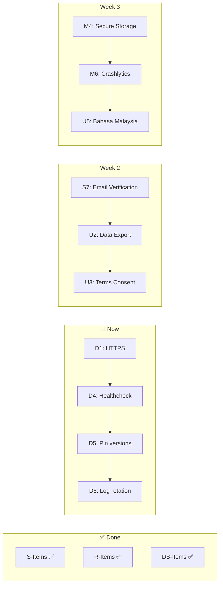

# FraudShield — Production-Ready Checklist

> **Last updated:** 23 Feb 2026 · Full audit of backend, Flutter, Docker, and infra.

---

## Summary of Findings

| Category | 🔴 Critical | 🟠 High | 🟡 Medium | ✅ Done | Total |
|----------|:-----------:|:-------:|:---------:|:------:|:-----:|
| Security & Auth | 0 | 1 | 0 | 9 | 10 |
| Backend Reliability | 0 | 0 | 3 | 3 | 6 |
| Database & Data | 0 | 0 | 2 | 2 | 4 |
| Deployment & Infra | 0 | 3 | 0 | 3 | 6 |
| Mobile App | 0 | 0 | 6 | 1 | 7 |
| UX & Compliance | 0 | 0 | 3 | 2 | 5 |
| **Total** | **0** | **4** | **14** | **20** | **38** |

> **Progress:** 20 of 38 items completed (~53%). **Critical blockers resolved.**

---

## 🔴 Critical Blockers (Must Fix Before Public Launch)

### Security & Auth — All Critical Items ✅ DONE

- [x] **S1. Remove hardcoded JWT fallback secret** ✅
  - Removed fallback `'your-super-secret-jwt-key'`. System throws on startup if `JWT_SECRET` is missing.
- [x] **S2. Stop logging request body in global error handler** ✅
  - Removed `body: req.body` from error handler to prevent logging passwords/tokens.
- [x] **S3. Restrict CORS origin in production** ✅
  - `CORS_ORIGIN` enforced in production mode.
- [x] **S4. Add auth middleware to change-password route** ✅
  - Route now protected by JWT authentication.
- [x] **S5. Require current password for password changes** ✅
  - Added current password verification before allowing updates.
- [x] **S9. Add request payload size limit** ✅
  - `express.json({ limit: '1mb' })` added to prevent OOM attacks.

### Deployment

- [x] **D1. Add HTTPS / reverse proxy (nginx)** ✅
  - Integrated Nginx and Certbot (Let's Encrypt) for automated SSL.
  - Locked down API port 3000 to internal traffic only.

- [x] **D2. Set `NODE_ENV=production` in Docker Compose** ✅
- [x] **D3. Set up automated database backups** ✅

---

## 🟠 High Priority (Should Fix Before Scaling)

### Security & Auth

- [x] **S6. Implement JWT refresh token flow** ✅
  - Added 15m access token + 30-day refresh token rotation.
- [ ] **S7. Implement real email verification** ⏱️ 3–4 hrs
  - Currently hardcoded to always verified.
- [x] **S8. Add input validation to report submission** ✅
  - Added `express-validator` rules to report routes.
- [x] **S10. Add rate limiting to auth endpoints** ✅
  - `authLimiter` and `loginLimiter` applied with `trust proxy` support.

### Backend Reliability

- [x] **R1. Wire rewards routes properly** ✅
  - Rewards logic wired through `feature.routes.ts`.
- [x] **R2. Add API pagination** ✅
  - Standardized `limit`/`offset` pagination for all feed/history endpoints.
- [x] **R3. Add request timeout / circuit breaker** ✅
  - 30s global timeout and 5s external service (FCM) timeout implemented.

### Deployment

- [ ] **D4. Add health check to Docker Compose** ⏱️ 10 min
- [ ] **D5. Pin Docker image versions** ⏱️ 10 min
- [ ] **D6. Configure log rotation** ⏱️ 10 min

### Database

- [x] **DB1. Add database indexes for query performance** ✅
- [x] **DB2. Enforce unique constraint on Verification** ✅

---

## 🟡 Medium Priority (Polish Before Public Store Release)

### Mobile App

- [x] **M1. Voice Detection → "Coming Soon"** ✅
- [ ] **M2. Add proper loading / error states** ⏱️ 2 hrs
- [ ] **M3. Add certificate pinning** ⏱️ 1 hr
- [ ] **M4. Secure token storage** ⏱️ 1 hr
- [ ] **M5. Add app versioning check** ⏱️ 1 hr
- [ ] **M6. Add crash reporting** ⏱️ 1 hr
- [ ] **M7. Remove debug logging from production** ⏱️ 30 min

### Backend

- [ ] **R4. Add structured logging with Winston** ⏱️ 1 hr
- [ ] **R5. Add unit tests beyond auth** ⏱️ 3–4 hrs
- [ ] **R6. Add API documentation (Swagger/OpenAPI)** ⏱️ 2 hrs

### Database

- [ ] **DB3. Add soft delete to ScamReport** ⏱️ 30 min
- [ ] **DB4. Add database connection pooling config** ⏱️ 10 min

### UX & Compliance

- [x] **U1. Add "Forgot Password" flow** ✅
- [x] **U4. User profile editing** ✅
- [ ] **U2. Add PDPA data export** ⏱️ 2 hrs
- [ ] **U3. Add Terms update consent** ⏱️ 1 hr
- [ ] **U5. Add Bahasa Malaysia localization** ⏱️ 6 hrs

---

## Recommended Execution Order

```mermaid
flowchart LR
    subgraph "✅ Done"
        S1["S-Items ✅"]
        R1["R-Items ✅"]
        DB1["DB-Items ✅"]
    end

    subgraph "🔴 Now"
        D1["D1: HTTPS"] --> D4["D4: Healthcheck"]
        D4 --> D5["D5: Pin versions"]
        D5 --> D6["D6: Log rotation"]
    end

    subgraph "Week 2"
        S7["S7: Email Verification"] --> U2["U2: Data Export"]
        U2 --> U3["U3: Terms Consent"]
    end

    subgraph "Week 3"
        M4["M4: Secure Storage"] --> M6["M6: Crashlytics"]
        M6 --> BM["U5: Bahasa Malaysia"]
    end
```
