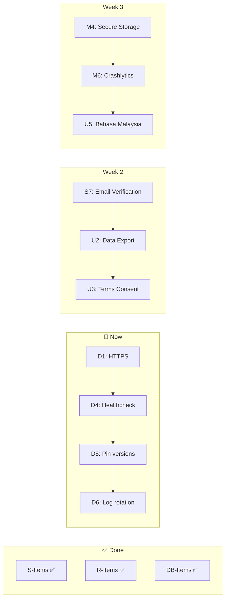

# FraudShield — Production-Ready Checklist

> **Last updated:** 25 Feb 2026 · Updated after full-stack audit. 10 new findings added.

---

## Summary of Findings

| Category | 🔴 Critical | 🟠 High | 🟡 Medium | ✅ Done | Total |
|----------|:-----------:|:-------:|:---------:|:------:|:-----:|
| Security & Auth | 0 | 1 | 0 | 9 | 10 |
| Backend Reliability | 1 | 2 | 2 | 3 | 8 |
| Database & Data | 0 | 0 | 3 | 2 | 5 |
| Deployment & Infra | 0 | 4 | 0 | 3 | 7 |
| Mobile App | 0 | 2 | 6 | 2 | 10 |
| UX & Compliance | 0 | 0 | 3 | 2 | 5 |
| **Total** | **1** | **9** | **14** | **21** | **45** |

> **Progress:** 21 of 45 items completed (~47%). **MVP is live. 10 new issues found in Feb 25 audit — 1 new critical, 5 new high.**

---

## 🔴 Critical Blockers (Must Fix Before Public Launch)

### Security & Auth — All Critical Items ✅ DONE

- [x] **S1. Remove hardcoded JWT fallback secret** ✅
  - Removed fallback `'your-super-secret-jwt-key'`. System throws on startup if `JWT_SECRET` is missing.
- [x] **S2. Stop logging request body in global error handler** ✅
  - Removed `body: req.body` from error handler to prevent logging passwords/tokens.
- [x] **S3. Restrict CORS origin in production** ✅
  - `CORS_ORIGIN` enforced in production mode.
- [x] **S4. Add auth middleware to change-password route** ✅
  - Route now protected by JWT authentication.
- [x] **S5. Require current password for password changes** ✅
  - Added current password verification before allowing updates.
- [x] **S9. Add request payload size limit** ✅
  - `express.json({ limit: '1mb' })` added to prevent OOM attacks.

### Deployment

- [x] **D1. Add HTTPS / reverse proxy (nginx)** ✅
  - Integrated Nginx and Certbot (Let's Encrypt) for automated SSL.
  - Locked down API port 3000 to internal traffic only.

- [x] **D2. Set `NODE_ENV=production` in Docker Compose** ✅
- [x] **D3. Set up automated database backups** ✅

---

## 🟠 High Priority (Should Fix Before Scaling)

### Security & Auth

- [x] **S6. Implement JWT refresh token flow** ✅
  - Added 15m access token + 30-day refresh token rotation.
- [ ] **S7. Implement real email verification** ⏱️ 3–4 hrs
  - Currently hardcoded to always verified.
- [x] **S8. Add input validation to report submission** ✅
  - Added `express-validator` rules to report routes.
- [x] **S10. Add rate limiting to auth endpoints** ✅
  - `authLimiter` and `loginLimiter` applied with `trust proxy` support.

### Backend Reliability

- [x] **R1. Wire rewards routes properly** ✅
  - Rewards logic wired through `feature.routes.ts`.
- [x] **R2. Add API pagination** ✅
  - Standardized `limit`/`offset` pagination for all feed/history endpoints.
- [x] **R3. Add request timeout / circuit breaker** ✅
  - 30s global timeout and 5s external service (FCM) timeout implemented.

### Deployment

- [x] **D4. Add health check to Docker Compose** ✅
- [x] **D5. Pin Docker image versions** ✅
- [x] **D6. Configure log rotation** ✅

### Database

- [x] **DB1. Add database indexes for query performance** ✅
- [x] **DB2. Enforce unique constraint on Verification** ✅

---

## 🟡 Medium Priority (Polish Before Public Store Release)

### Mobile App

- [x] **M1. Voice Detection → "Coming Soon"** ✅
- [x] **M2. Add proper loading / error states** ✅
- [x] **M3. Add certificate pinning** ✅
- [ ] **M4. Secure token storage** ⏱️ 1 hr
- [ ] **M5. Add app versioning check** ⏱️ 1 hr
- [x] **M6. Add crash reporting** ✅
  - Integrated Firebase Crashlytics (Feb 24). Crash events stream to Firebase console.
- [ ] **M7. Remove debug logging from production** ⏱️ 30 min

### Backend

- [x] **R4. Add structured logging with Winston** ✅
- [ ] **R5. Add unit tests beyond auth** ⏱️ 3–4 hrs
- [ ] **R6. Add API documentation (Swagger/OpenAPI)** ⏱️ 2 hrs

### Database

- [ ] **DB3. Add soft delete to ScamReport** ⏱️ 30 min
- [ ] **DB4. Add database connection pooling config** ⏱️ 10 min

### UX & Compliance

- [x] **U1. Add "Forgot Password" flow** ✅
- [x] **U4. User profile editing** ✅
- [x] **U2. Add PDPA data export** ✅
- [x] **U3. Add Terms update consent** ✅
- [ ] **U5. Add Bahasa Malaysia localization** ⏱️ 6 hrs

---

## Recommended Execution Order

```mermaid
flowchart LR
    subgraph "✅ Done"
        S1["S-Items ✅"]
        R1["R-Items ✅"]
        DB1["DB-Items ✅"]
    end

    subgraph "🔴 Now"
        D1["D1: HTTPS"] --> D4["D4: Healthcheck"]
        D4 --> D5["D5: Pin versions"]
        D5 --> D6["D6: Log rotation"]
    end

    subgraph "Week 2"
        S7["S7: Email Verification"] --> U2["U2: Data Export"]
        U2 --> U3["U3: Terms Consent"]
    end

    subgraph "Week 3"
        M4["M4: Secure Storage"] --> M6["M6: Crashlytics"]
        M6 --> BM["U5: Bahasa Malaysia"]
    end
```

---

## 🆕 New Findings — Feb 25, 2026 Audit

### 🔴 Critical

- [ ] **B1. Real email service** ⏱️ 2 hrs
  - `email.service.ts` logs OTP to console — password reset broken in production. Integrate Nodemailer + SMTP (Brevo/SendGrid free tier).

### 🟠 High

- [ ] **B2. Re-add rewards route** ⏱️ 30 min
  - `rewards.routes.ts` is commented out in `app.ts`. The `rewards.controller.ts` (17 KB) exists but `/api/v1/rewards` returns 404. Create route file and uncomment.
- [ ] **B3. Replace `console.log` in alert-engine** ⏱️ 30 min
  - `alert-engine.service.ts` has 9 bare `console.log/error` calls that bypass Winston in production.
- [ ] **B4. Wire Semak Mule into risk evaluation** ⏱️ 3 hrs
  - `semak-mule.service.ts` exists but `RiskEvaluationService.evaluate()` never calls it. Phone checks are still crowdsource-only.
- [ ] **B10. Move Firebase service account JSON to env var** ⏱️ 30 min
  - `fraudshield-271b0-firebase-adminsdk-fbsvc-2a70150a06.json` is committed to the repo. Move to `FIREBASE_SERVICE_ACCOUNT` env var.
- [ ] **F9. Fix Google Sign-In hang** ⏱️ 2 hrs
  - Tapping "Sign in with Google" hangs after auth. Backend `/auth/google` route exists. Debug callback flow (see conv. 1d82a697).

### 🟡 Medium

- [ ] **F2. Remove hardcoded `_isAndroidEmulator = true`** ⏱️ 5 min
  - `api_service.dart:13` has a static bool that could cause subtle bugs if referenced later. Remove or replace with `kDebugMode`.
- [ ] **F7. Remove `test_screen.dart`** ⏱️ 5 min
  - `lib/screens/test_screen.dart` (4.5 KB) is in the production screen folder. Exclude from release.
- [ ] **F8. Delete empty `transaction_screen.dart`** ⏱️ 5 min
  - `lib/screens/transaction_screen.dart` is 0 bytes. Delete or implement.
- [ ] **DB5. Soft delete on ScamReport** ⏱️ 30 min
  - Reports are hard-deleted. Add `deletedAt DateTime?` field and scope all queries accordingly.
