# FraudShield — Production-Ready Checklist

> **Last updated:** 20 Feb 2026 · Based on audit of all backend source files, middleware, services, configs, Docker setup, and Flutter app

---

## Summary of Findings

| Category | 🔴 Critical | 🟠 High | 🟡 Medium | Total |
|----------|:-----------:|:-------:|:---------:|:-----:|
| Security & Auth | 5 | 4 | 3 | 12 |
| Backend Reliability | 2 | 3 | 3 | 8 |
| Database & Data | 2 | 2 | 2 | 6 |
| Deployment & Infra | 3 | 3 | 2 | 8 |
| Mobile App | 1 | 3 | 3 | 7 |
| UX & Compliance | 1 | 2 | 3 | 6 |
| **Total** | **14** | **17** | **16** | **47** |

---

## 🔴 Critical Blockers (Must Fix Before Public Launch)

### Security & Auth

- [ ] **S1. Remove hardcoded JWT fallback secret**
  - [auth.service.ts](file:///c:/Fraudshield/fraudshield-backend/src/services/auth.service.ts#L6): `JWT_SECRET = process.env.JWT_SECRET || 'your-super-secret-jwt-key'`
  - If `JWT_SECRET` env var is missing, the app falls back to a predictable key. Anyone can forge tokens.
  - **Fix:** Throw on startup if `JWT_SECRET` is not set. Remove the fallback string.
  - ⏱️ 10 min

- [ ] **S2. Stop logging request body in global error handler**
  - [app.ts:112](file:///c:/Fraudshield/fraudshield-backend/src/app.ts#L112): `body: req.body`
  - Passwords and sensitive data are logged on every error. This appears in Docker logs and stdout.
  - **Fix:** Remove `body: req.body` from the error handler, or redact sensitive fields.
  - ⏱️ 10 min

- [ ] **S3. Restrict CORS origin in production**
  - [app.ts:34](file:///c:/Fraudshield/fraudshield-backend/src/app.ts#L34): Falls back to `'*'` if `CORS_ORIGIN` is not set.
  - **Fix:** Set `CORS_ORIGIN` in `.env.prod` or default to no fallback.
  - ⏱️ 10 min

- [x] **S4. Add auth middleware to change-password route**
  - [auth.routes.ts:21](file:///c:/Fraudshield/fraudshield-backend/src/routes/auth.routes.ts#L21): `router.post('/change-password', AuthController.changePassword)` — no `authenticate` middleware.
  - Anyone can call this endpoint without being logged in (though `req.user` would be undefined).
  - **Fix:** Add `authenticate` middleware before `AuthController.changePassword`.
  - ⏱️ 5 min

- [x] **S5. Require current password for password changes**
  - [auth.controller.ts:113](file:///c:/Fraudshield/fraudshield-backend/src/controllers/auth.controller.ts#L112-128): Only accepts `newPassword`, never verifies the current password.
  - **Fix:** Accept `currentPassword`, verify it with `bcrypt.compare`, then allow the change.
  - ⏱️ 30 min

### Deployment

- [ ] **D1. Add HTTPS / reverse proxy (nginx)**
  - [docker-compose.prod.yml:31](file:///c:/Fraudshield/fraudshield-backend/docker-compose.prod.yml#L31): Port 3000 is exposed directly with no TLS.
  - All API traffic (including auth tokens) is sent in plaintext.
  - **Fix:** Add an nginx container with Let's Encrypt SSL, or use Cloudflare proxy.
  - ⏱️ 1–2 hrs

- [x] **D2. Set `NODE_ENV=production` in Docker Compose**
  - Already done in `docker-compose.prod.yml:37` ✅ — but verify the **actual `.env`** on the droplet matches.
  - ⏱️ 5 min

- [ ] **D3. Set up automated database backups**
  - No backup strategy exists. A single `DROP TABLE` or disk failure loses all data.
  - **Fix:** Add a cron job or pg_dump script to backup to DigitalOcean Spaces or S3 daily.
  - ⏱️ 1 hr

### Database

- [ ] **DB1. Add database indexes for query performance**
  - `ScamReport.isPublic`, `ScamReport.createdAt`, `ScamReport.category` — these are used in `WHERE` and `ORDER BY` clauses for the public feed but have no indexes.
  - **Fix:** Add `@@index` directives to `schema.prisma`.
  - ⏱️ 15 min

- [ ] **DB2. Enforce unique constraint on Verification**
  - A user can currently verify the same report multiple times (duplicate entries).
  - **Fix:** Add `@@unique([reportId, userId])` to the `Verification` model.
  - ⏱️ 10 min

---

## 🟠 High Priority (Should Fix Before Scaling)

### Security & Auth

- [ ] **S6. Implement JWT refresh token flow**
  - Currently tokens expire after 7 days with no way to refresh. Users must re-login.
  - **Fix:** Issue a short-lived access token (15 min) + long-lived refresh token (30 days). Add a `/auth/refresh` endpoint.
  - ⏱️ 2–3 hrs

- [ ] **S7. Implement real email verification**
  - [auth.service.ts:46](file:///c:/Fraudshield/fraudshield-backend/src/services/auth.service.ts#L46): `isEmailVerified: true` is hardcoded.
  - **Fix:** Send verification email on signup, add `isEmailVerified` column to `User`, gate certain features on it.
  - ⏱️ 3–4 hrs

- [ ] **S8. Add input validation to report submission**
  - `submitReport` accepts arbitrary `type`, `category`, `target`, and `evidence` without validation.
  - **Fix:** Add `express-validator` rules (like the auth validators) to the report routes.
  - ⏱️ 1 hr

- [ ] **S9. Add request payload size limit**
  - `express.json()` has no `limit` option. Large payloads could exhaust memory.
  - **Fix:** `app.use(express.json({ limit: '1mb' }))`.
  - ⏱️ 5 min

### Backend Reliability

- [ ] **R1. Re-enable rewards routes**
  - [app.ts:73](file:///c:/Fraudshield/fraudshield-backend/src/app.ts#L73): `rewardsRoutes` is commented out as "file is missing".
  - The rewards controller exists (`rewards.controller.ts`), but the route file may be missing.
  - **Fix:** Create `rewards.routes.ts` and uncomment the import.
  - ⏱️ 30 min

- [ ] **R2. Add API pagination**
  - `getPublicFeed`, `getMyReports`, `searchReports` return all records. Will degrade with data growth.
  - **Fix:** Add `skip`/`take` (or cursor-based) pagination with a default `limit=20`.
  - ⏱️ 1 hr

- [ ] **R3. Add request timeout / circuit breaker**
  - No timeout on database queries. If Postgres is slow, requests hang indefinitely.
  - **Fix:** Set Prisma connection timeout and add a global request timeout middleware.
  - ⏱️ 30 min

### Deployment

- [ ] **D4. Add health check to Docker Compose**
  - The `api` service has no `healthcheck` directive. Docker won't know if the app crashes internally.
  - **Fix:** Add `healthcheck: test: ["CMD", "wget", "-q", "--spider", "http://localhost:3000/health"]`.
  - ⏱️ 10 min

- [ ] **D5. Pin Docker image versions**
  - `node:20-alpine`, `postgres:16-alpine`, `redis:7-alpine` — Alpine patch versions may change.
  - **Fix:** Pin to specific digests or patch versions (e.g., `node:20.11-alpine`).
  - ⏱️ 10 min

- [ ] **D6. Configure log rotation**
  - Docker logs grow indefinitely. `morgan('combined')` in production writes to stdout without rotation.
  - **Fix:** Add `logging: driver: json-file` with `max-size: 10m` and `max-file: 5` in Docker Compose.
  - ⏱️ 10 min

### Database

- [ ] **DB3. Add soft delete to ScamReport**
  - Reports cannot be removed by admins without hard-deleting data.
  - **Fix:** Add `deletedAt DateTime?` and filter queries with `WHERE deletedAt IS NULL`.
  - ⏱️ 30 min

- [ ] **DB4. Add database connection pooling**
  - Prisma's default connection pool may be insufficient under load.
  - **Fix:** Configure `connection_limit` in the `DATABASE_URL` (e.g., `?connection_limit=10`).
  - ⏱️ 10 min

---

## 🟡 Medium Priority (Polish Before Public Store Release)

### Mobile App

- [ ] **M1. Voice Detection → "Coming Soon"**
  - `voice_detection_screen.dart` still returns random results (`DateTime.now().second % 2`). Users may think this is a real feature.
  - **Fix:** Replace with a "Coming Soon" overlay or lock it behind a feature flag.
  - ⏱️ 30 min

- [ ] **M2. Add proper loading / error states**
  - Many screens (Community Feed, Report History, Rewards) show a blank screen or spinner on failure.
  - **Fix:** Add error banners with retry buttons. Show cached data when offline.
  - ⏱️ 2 hrs

- [ ] **M3. Add certificate pinning**
  - The app trusts all TLS certificates. Man-in-the-middle attacks can intercept tokens.
  - **Fix:** Pin the server's certificate in `network_security_config.xml` and Flutter HTTP client.
  - ⏱️ 1 hr

- [ ] **M4. Secure token storage**
  - Tokens are stored in `SharedPreferences` (plaintext on Android).
  - **Fix:** Use `flutter_secure_storage` which uses Android Keystore / iOS Keychain.
  - ⏱️ 1 hr

- [ ] **M5. Add app versioning check**
  - No mechanism to force-update the app when breaking backend changes are deployed.
  - **Fix:** Add a `/api/v1/version` endpoint and check on app startup.
  - ⏱️ 1 hr

- [ ] **M6. Add analytics / crash reporting**
  - No crash reporting (Firebase Crashlytics, Sentry) is integrated. Crashes in production are invisible.
  - **Fix:** Integrate Firebase Crashlytics or Sentry.
  - ⏱️ 1 hr

- [ ] **M7. Remove debug logging from production builds**
  - `debugPrint('[CommunityFeed]...')` calls appear in production. These leak internal data.
  - **Fix:** Wrap debug prints in `kDebugMode` checks or use a logger with configurable levels.
  - ⏱️ 30 min

### Backend

- [ ] **R4. Add structured logging with Winston**
  - `winston` is a dependency but unused. All logging uses `console.log`/`console.error`.
  - **Fix:** Initialize Winston logger with JSON format and file/cloud transport.
  - ⏱️ 1 hr

- [ ] **R5. Add unit tests beyond auth**
  - Only `auth.controller` has tests. Report, rewards, and feature controllers have no test coverage.
  - **Fix:** Add Jest tests for critical endpoints (submit report, verify, public feed).
  - ⏱️ 3–4 hrs

- [ ] **R6. Add API documentation (Swagger/OpenAPI)**
  - No API docs exist. Frontend development relies on reading source code.
  - **Fix:** Add `swagger-jsdoc` + `swagger-ui-express` or generate from route definitions.
  - ⏱️ 2 hrs

### UX & Compliance

- [ ] **U1. Add "Forgot Password" flow**
  - No password reset mechanism. Users who forget their password are locked out.
  - **Fix:** Add email-based password reset with a time-limited OTP or reset link.
  - ⏱️ 3–4 hrs

- [ ] **U2. Add PDPA data export**
  - PDPA Section 12 requires users to be able to export their personal data. Only delete exists.
  - **Fix:** Add a "Download My Data" button to the Account screen + backend endpoint.
  - ⏱️ 2 hrs

- [ ] **U3. Add Terms update consent**
  - If ToS or Privacy Policy change, users aren't re-prompted to accept.
  - **Fix:** Track `tosAcceptedVersion` in Profile and prompt on version mismatch.
  - ⏱️ 1 hr

---

## Recommended Execution Order

```mermaid
flowchart LR
    subgraph "Week 1 — Critical Security"
        S1[S1: JWT fallback] --> S2[S2: Error logging]
        S2 --> S3[S3: CORS origin]
        S3 --> S4[S4: Change-password auth]
        S4 --> S5[S5: Verify current password]
        S4 --> S9[S9: Payload size limit]
    end

    subgraph "Week 2 — Infrastructure"
        D1[D1: HTTPS/nginx] --> D3[D3: DB backups]
        D3 --> D4[D4: Docker healthcheck]
        D4 --> D5[D5: Pin versions]
        D5 --> D6[D6: Log rotation]
    end

    subgraph "Week 3 — Data Integrity"
        DB1[DB1: Indexes] --> DB2[DB2: Unique verification]
        DB2 --> R2[R2: Pagination]
        R2 --> R1[R1: Rewards routes]
    end

    subgraph "Week 4 — App Polish"
        M1[M1: Voice → Coming Soon] --> M4[M4: Secure storage]
        M4 --> M7[M7: Remove debug logs]
        M7 --> M6[M6: Crash reporting]
    end

    subgraph "Week 5–6 — Auth & Compliance"
        S6[S6: Refresh tokens] --> S7[S7: Email verification]
        S7 --> U1[U1: Forgot password]
        U1 --> U2[U2: Data export]
    end
```

---

## Quick Reference: Effort Estimates

| Effort | Count | Time |
|--------|:-----:|------|
| ⚡ Under 15 min | 10 | ~2 hrs total |
| 🟡 30 min – 1 hr | 15 | ~12 hrs total |
| 🟢 1–2 hrs | 12 | ~18 hrs total |
| 🔵 3–4 hrs | 5 | ~18 hrs total |
| **Grand Total** | **42** | **~50 hrs** |

> The 10 items under 15 minutes can all be done in a single focused session and eliminate the most dangerous vulnerabilities.
