# FraudShield — Production-Ready Checklist

> **Last updated:** 22 Feb 2026 · Based on audit of all backend source files, middleware, services, configs, Docker setup, and Flutter app

---

## Summary of Findings

| Category | 🔴 Critical | 🟠 High | 🟡 Medium | ✅ Done | Total |
|----------|:-----------:|:-------:|:---------:|:------:|:-----:|
| Security & Auth | 1 | 4 | 3 | 5 | 13 |
| Backend Reliability | 2 | 3 | 3 | 0 | 8 |
| Database & Data | 2 | 2 | 0 | 0 | 4 |
| Deployment & Infra | 1 | 3 | 2 | 2 | 8 |
| Mobile App | 0 | 3 | 3 | 1 | 7 |
| UX & Compliance | 0 | 2 | 3 | 1 | 6 |
| **Total** | **6** | **17** | **14** | **9** | **46** |

> **Progress:** 9 of 46 items completed (~20%). All critical security items except HTTPS/SSL are done.

---

## 🔴 Critical Blockers (Must Fix Before Public Launch)

### Security & Auth

- [x] **S1. Remove hardcoded JWT fallback secret** ⏱️ 10 min ✅
  - [auth.service.ts](file:///c:/Fraudshield/fraudshield-backend/src/services/auth.service.ts#L6): Removed fallback `'your-super-secret-jwt-key'`. System now throws on startup if `JWT_SECRET` is missing.

- [x] **S2. Stop logging request body in global error handler** ⏱️ 10 min ✅
  - [app.ts](file:///c:/Fraudshield/fraudshield-backend/src/app.ts): Removed `body: req.body` from error handler.

- [x] **S3. Restrict CORS origin in production** ⏱️ 10 min ✅
  - `CORS_ORIGIN` set in `.env.prod`. No longer falls back to `'*'`.

- [x] **S4. Add auth middleware to change-password route** ⏱️ 5 min ✅
  - [auth.routes.ts](file:///c:/Fraudshield/fraudshield-backend/src/routes/auth.routes.ts): `authenticate` middleware added before `changePassword`.

- [x] **S5. Require current password for password changes** ⏱️ 30 min ✅
  - [auth.controller.ts](file:///c:/Fraudshield/fraudshield-backend/src/controllers/auth.controller.ts): Now accepts `currentPassword`, verifies with `bcrypt.compare` before allowing change.

### Deployment

- [ ] **D1. Add HTTPS / reverse proxy (nginx)** ⏱️ 1–2 hrs 🔴
  - [docker-compose.prod.yml](file:///c:/Fraudshield/fraudshield-backend/docker-compose.prod.yml): Port 3000 still exposed directly with no TLS.
  - All API traffic (including auth tokens) is sent in plaintext.
  - **Fix:** Add an nginx container with Let's Encrypt SSL, or use Cloudflare proxy.

- [x] **D2. Set `NODE_ENV=production` in Docker Compose** ⏱️ 5 min ✅
  - Already set in `docker-compose.prod.yml` and verified on droplet.

- [x] **D3. Set up automated database backups** ⏱️ 1 hr ✅
  - Daily pg_dump backup script configured.

### Database

- [ ] **DB1. Add database indexes for query performance** ⏱️ 15 min
  - `ScamReport.isPublic`, `ScamReport.createdAt`, `ScamReport.category` — used in `WHERE` and `ORDER BY` but have no indexes.
  - **Fix:** Add `@@index` directives to `schema.prisma`.

- [ ] **DB2. Enforce unique constraint on Verification** ⏱️ 10 min
  - A user can currently verify the same report multiple times (duplicate entries).
  - **Fix:** Add `@@unique([reportId, userId])` to the `Verification` model.

---

## 🟠 High Priority (Should Fix Before Scaling)

### Security & Auth

- [ ] **S6. Implement JWT refresh token flow** ⏱️ 2–3 hrs
  - Currently tokens expire after 7 days with no way to refresh. Users must re-login.
  - **Fix:** Issue a short-lived access token (15 min) + long-lived refresh token (30 days). Add a `/auth/refresh` endpoint.

- [ ] **S7. Implement real email verification** ⏱️ 3–4 hrs
  - [auth.service.ts](file:///c:/Fraudshield/fraudshield-backend/src/services/auth.service.ts): `isEmailVerified: true` is hardcoded.
  - **Fix:** Send verification email on signup, add `isEmailVerified` column to `User`, gate certain features on it.

- [ ] **S8. Add input validation to report submission** ⏱️ 1 hr
  - `submitReport` accepts arbitrary `type`, `category`, `target`, and `evidence` without validation.
  - **Fix:** Add `express-validator` rules to the report routes.

- [x] **S9. Add request payload size limit** ⏱️ 5 min ✅
  - `express.json({ limit: '1mb' })` added in `app.ts`.

### Backend Reliability

- [ ] **R1. Re-enable rewards routes** ⏱️ 30 min
  - [app.ts](file:///c:/Fraudshield/fraudshield-backend/src/app.ts): `rewardsRoutes` is commented out as "file is missing".
  - **Fix:** Create `rewards.routes.ts` and uncomment the import.

- [ ] **R2. Add API pagination** ⏱️ 1 hr
  - `getPublicFeed`, `getMyReports`, `searchReports` return all records. Will degrade with data growth.
  - **Fix:** Add `skip`/`take` (or cursor-based) pagination with a default `limit=20`.

- [ ] **R3. Add request timeout / circuit breaker** ⏱️ 30 min
  - No timeout on database queries. If Postgres is slow, requests hang indefinitely.
  - **Fix:** Set Prisma connection timeout and add a global request timeout middleware.

### Deployment

- [ ] **D4. Add health check to Docker Compose** ⏱️ 10 min
  - The `api` service has no `healthcheck` directive.
  - **Fix:** Add `healthcheck: test: ["CMD", "wget", "-q", "--spider", "http://localhost:3000/health"]`.

- [ ] **D5. Pin Docker image versions** ⏱️ 10 min
  - `node:20-alpine`, `postgres:16-alpine`, `redis:7-alpine` — patch versions may change.
  - **Fix:** Pin to specific digests or patch versions (e.g., `node:20.11-alpine`).

- [ ] **D6. Configure log rotation** ⏱️ 10 min
  - Docker logs grow indefinitely.
  - **Fix:** Add `logging: driver: json-file` with `max-size: 10m` and `max-file: 5` in Docker Compose.

### Database

- [ ] **DB3. Add soft delete to ScamReport** ⏱️ 30 min
  - Reports cannot be removed by admins without hard-deleting data.
  - **Fix:** Add `deletedAt DateTime?` and filter queries with `WHERE deletedAt IS NULL`.

- [ ] **DB4. Add database connection pooling** ⏱️ 10 min
  - Prisma's default connection pool may be insufficient under load.
  - **Fix:** Configure `connection_limit` in the `DATABASE_URL` (e.g., `?connection_limit=10`).

---

## 🟡 Medium Priority (Polish Before Public Store Release)

### Mobile App

- [x] **M1. Voice Detection → "Coming Soon"** ⏱️ 30 min ✅
  - Replaced random results with a "Coming Soon" overlay.

- [ ] **M2. Add proper loading / error states** ⏱️ 2 hrs
  - Many screens show a blank screen or spinner on failure.
  - **Fix:** Add error banners with retry buttons. Show cached data when offline.

- [ ] **M3. Add certificate pinning** ⏱️ 1 hr
  - The app trusts all TLS certificates.
  - **Fix:** Pin the server's certificate in `network_security_config.xml` and Flutter HTTP client.

- [ ] **M4. Secure token storage** ⏱️ 1 hr
  - Tokens are stored in `SharedPreferences` (plaintext on Android).
  - **Fix:** Use `flutter_secure_storage` which uses Android Keystore / iOS Keychain.

- [ ] **M5. Add app versioning check** ⏱️ 1 hr
  - No mechanism to force-update the app when breaking backend changes are deployed.
  - **Fix:** Add a `/api/v1/version` endpoint and check on app startup.

- [ ] **M6. Add analytics / crash reporting** ⏱️ 1 hr
  - No crash reporting (Firebase Crashlytics, Sentry) is integrated.
  - **Fix:** Integrate Firebase Crashlytics or Sentry.

- [ ] **M7. Remove debug logging from production builds** ⏱️ 30 min
  - `debugPrint('[CommunityFeed]...')` calls appear in production.
  - **Fix:** Wrap debug prints in `kDebugMode` checks or use a logger with configurable levels.

### Backend

- [ ] **R4. Add structured logging with Winston** ⏱️ 1 hr
  - `winston` is a dependency but unused. All logging uses `console.log`/`console.error`.
  - **Fix:** Initialize Winston logger with JSON format and file/cloud transport.

- [ ] **R5. Add unit tests beyond auth** ⏱️ 3–4 hrs
  - Only `auth.controller` has tests. Report, rewards, and feature controllers have no test coverage.
  - **Fix:** Add Jest tests for critical endpoints (submit report, verify, public feed).

- [ ] **R6. Add API documentation (Swagger/OpenAPI)** ⏱️ 2 hrs
  - No API docs exist. Frontend development relies on reading source code.
  - **Fix:** Add `swagger-jsdoc` + `swagger-ui-express` or generate from route definitions.

### UX & Compliance

- [x] **U1. Add "Forgot Password" flow** ⏱️ 3–4 hrs ✅
  - Email-based password reset with time-limited OTP implemented.

- [ ] **U2. Add PDPA data export** ⏱️ 2 hrs
  - PDPA Section 12 requires users to be able to export their personal data.
  - **Fix:** Add a "Download My Data" button to the Account screen + backend endpoint.

- [ ] **U3. Add Terms update consent** ⏱️ 1 hr
  - If ToS or Privacy Policy change, users aren't re-prompted to accept.
  - **Fix:** Track `tosAcceptedVersion` in Profile and prompt on version mismatch.

---

## Recommended Execution Order

```mermaid
flowchart LR
    subgraph "✅ Done — Critical Security"
        S1[S1: JWT fallback ✅] --> S2[S2: Error logging ✅]
        S2 --> S3[S3: CORS origin ✅]
        S3 --> S4[S4: Change-password auth ✅]
        S4 --> S5[S5: Verify current password ✅]
        S4 --> S9[S9: Payload size limit ✅]
    end

    subgraph "🔴 Next — Infrastructure"
        D1[D1: HTTPS/nginx] --> D4[D4: Docker healthcheck]
        D4 --> D5[D5: Pin versions]
        D5 --> D6[D6: Log rotation]
    end

    subgraph "Week 2 — Data Integrity"
        DB1[DB1: Indexes] --> DB2[DB2: Unique verification]
        DB2 --> R2[R2: Pagination]
        R2 --> R1[R1: Rewards routes]
    end

    subgraph "Week 3 — App Polish"
        M4[M4: Secure storage] --> M7[M7: Remove debug logs]
        M7 --> M6[M6: Crash reporting]
    end

    subgraph "Week 4 — Auth & Compliance"
        S6[S6: Refresh tokens] --> S7[S7: Email verification]
        S7 --> U2[U2: Data export]
    end
```

---

## Quick Reference: Effort Estimates

| Effort | Remaining | Time |
|--------|:---------:|------|
| ⚡ Under 15 min | 6 | ~1.5 hrs total |
| 🟡 30 min – 1 hr | 12 | ~8 hrs total |
| 🟢 1–2 hrs | 10 | ~15 hrs total |
| 🔵 3–4 hrs | 3 | ~10 hrs total |
| **Grand Total Remaining** | **31** | **~34.5 hrs** |

> Previously completed: **9 items** (~15.5 hrs of work done). Remaining work is ~34.5 hrs across 31 items.
